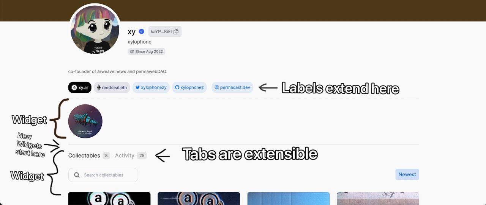

# Build social with Arweave data: decent.land mini-hackathon

Starting September 19th, the ar.page hackathon is open to all developers! Use a stack of identity tooling built on Arweave and EVM to build better web3 social.

ar.page is a cross-chain social identity aggregator. All your blockchain info and activity for Arweave Name Service (ANS) users, stored in one place.

### ar.page, Ark, and ANS

Arweave Names Service (ANS) is an identity and social metadata protocol built on Arweave. It is the username layer of decent.land as well as a human-readable proxy for wallet addresses, supported by [ViewBlock](https://v2.viewblock.io/)

ar.page, the ANS profile explorer, is a specifically designed to be expanded with useful data views, built as individual components.

The decent.land Ark API is able to return on-chain activity on Arweave and EVM chains, token holdings, NFTs, DAO memberships etc., for given ANS user identities.

**…with all of that data combined, there’s a lot the [ar.page](http://ar.page) dApp could show about a user!**

### Goals

The goal of this hackathon is to use ANS and Ark to display interesting insights about Arweave users on [ar.page](https://ar.page) - build a new UI component, integrate a new data source, or enrich data we already have.

How can we slice and transform a user's on-chain data and display it in a way that they'll want to show off?

The specifics are open-ended, but **here are some ideas** we think would be awesome for the Arweave ecosystem and beyond:

- Add badges to show DAO and PSC membership
- Aggregated tweets or other linked social web3 data sources like Mirror.xyz
- Integrate Arweave’s Stamp protocol - show a user’s stamps, and allow users to stamp other profiles
- Add more ways to get verified status with VouchDAO or with ArNS name linking
- Expand existing components (e.g. build search and filters into the activity feed or collections view)
- Build components for subsections of a user’s collection, e.g: all of their metaverse land, all of their ANS names…
- Show a user's permacast podcasts or Pianity tracks with the [weave-aggregator](https://github.com/decentldotland/weave-aggregator)

### Rules

- Submissions must be your own original work
- Submissions must be a fork of this repo ([ANS_UI_2.0](https://github.com/decentldotland/ANS_UI_2.0))
- The component built must be shown in the context of ar.page, with a link to the live functioning, and running instance of the app itself, as well as a link to the repository it is stored within.
- Submissions must be open source, with the full source code available on GitHub or another open code hosting site. Feel free to use whatever OSS licence you prefer.
- All submissions must include a brief description of the application and functionality in the GitHub repo.

### Structure

**Sign up to the hackathon**

- Fill out [the short registration form](https://forms.gle/evsxaX63nGHgn3DD7)
- [Join the Discord](http://discord.gg/decentland), claim your Ark Engineer role in #pick-a-role
- Post your idea in #app-ideas in the [Discord](http://discord.gg/decentland)
- Connect your Arweave address with [Ark Protocol](http://ark.decent.land)

**Claim the participation POAP**

- Have your #app-ideas approved by a Monolithic Statue in Discord
- Fork the [hackathon repo](https://github.com/decentldotland/ANS_UI_2.0/tree/UI2.0/components_new/user/hackathon)
- Submit your early progress in the #hackathon channel in Discord

**Submit your entry**

- Ensure your entry is complete, tested, and in line with the Rules.
- Mention a Monolithic Statue in the #hackathon channel with your repo and README for review

### Prizes

Prizes will be awarded to the individual/team that produces the best ar.page UI component or data source integration while respecting the challenge description, goals, and criteria.

- First prize: $4.5k USDC or AR + an [Ark NFT](http://mint.decent.land) of 0.3 ETH value
- Runner-up pool: $6k USDC or AR, split between accepted entrants
- Participation POAPs for entries

## Dates and Timing
**Start / end dates**: September 19th - October 31st

**Voting**: November 1st - November 7th

**Final Result Announcement**: November 7th

## Requirements
Submissions must:
1. Be in the context of ar.page, with a link to the live functioning, and running instance of the app itself, as well as a link to the repository it is stored within.
2. Include a brief description of the application and functionality in the GitHub repo.
3. Be your own original work.
4. Only change items within the `hackathon` folder.
5. Be open source, with the full source code available on GitHub or another open code hosting site.

## Guidelines

[ARK API](https://github.com/decentldotland/ark-network) provides all the user data that you can find on the frontend. To get familiar with the data, check out the TypeScript interface [Res](/src/types/index.ts).

We support several different profile extension options by default:



All the profile items are considered widgets, and adding new widgets is as simple as heading over to `api/widgets.tsx` and adding a new JSX element into the array!

```TSX
export function HackathonTopWidgets (arkProfile: Res | undefined) {
  // It's important to wrap custom components in Widget tag
  const NewWidget = <Widget canRender={true}>Hi, I am a new widget!</Widget>;

  const widgets = [NewWidget];

  return widgets;
};
```

Check out the `api` folder for more code examples. If you'd like to be able to extend other parts of our UI, let us know in our [discord](https://discord.gg/decentland)!

You can also suggest your ideas in our [discord](https://discord.gg/decentland) channel (#app-ideas)
### Contribution Tips

Feel free to change items within the `hackathon` folder as you see fit. There are no restrictions to using third-party libraries or data fetching.

To properly judge your submission we'd need to review both your code and the result. To make things simpler for us, please leave comments where applicable to help us understand your work better.

### CSS Documentation
The project uses a mix of [TailwindCSS](https://tailwindcss.com) + [daisyUI](https://daisyui.com), which provides all of the components, styles and colors.
When writing custom components, keep in mind to use daisyUI color scheme to keep light/dark themes consistent.

`[prefix]-base-100` - The default background color of the website
`[prefix]-base-200` - Slightly darker version of the default background color
`[prefix]-primary` - Default primary color for all the existing UI components

daisyUI supports mixing theme colors, so you can do `bg-primary`, `text-base-100`, `bg-info`, etc. For all existing daisyUI color scheme patterns, check out the (theme generator)[https://daisyui.com/theme-generator].

Finally, you may add new `tailwindcss.config.js` variables / modules. However, please avoid editing existing parameters.
